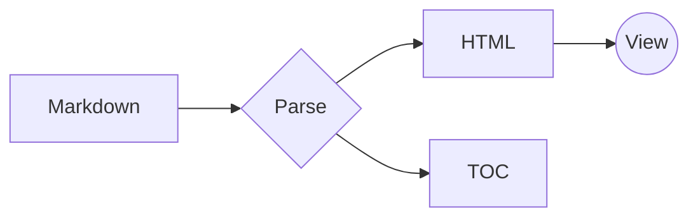
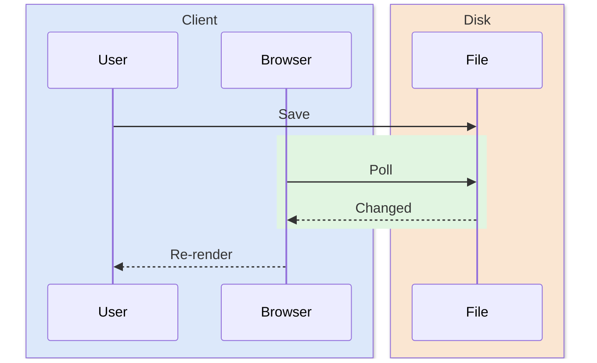
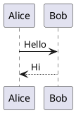

# Diagrams and math

## Flowchart

```mermaid
flowchart LR
  A[Markdown] --> B{Parse}
  B --> C[HTML]
  B --> D[TOC]
  C --> E((View))
```

## Sequence

```mermaid
sequenceDiagram
  box rgb(220,232,250) Client
    participant U as User
    participant B as Browser
  end
  box rgb(250,230,210) Disk
    participant F as File
  end
  U->>F: Save
  rect rgb(225,245,225)
    B->>F: Poll
    F-->>B: Changed
  end
  B-->>U: Re-render
```

## PlantUML

```plantuml
@startuml
Alice -> Bob: Hello
Bob --> Alice: Hi
@enduml
```

## Math

Inline math such as $E = mc^2$ sits in the text.

$$
\int_0^\infty e^{-x^2}\,dx = \frac{\sqrt{\pi}}{2}
$$
